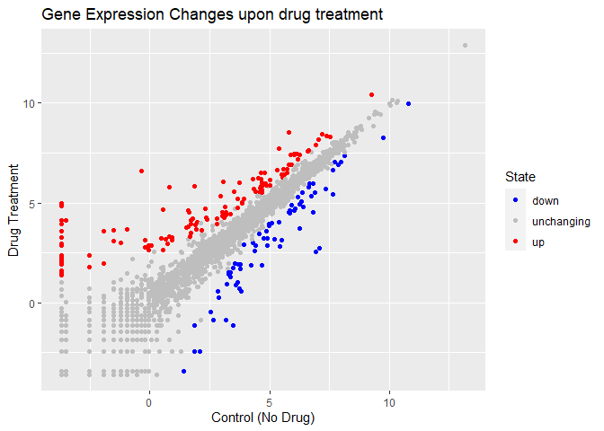

class 5: Data Visualization
================
Joshua

# Plotting in R

R has multipled plotting and graphics systems. The most popular of which
is **ggplot2**

``` r
plot(cars)
```


Compared to base R plots ggplot is much more verbose.

To use ggplot one needs to first install the ggplot2 package, using the
`install.packages()` command. This only needs to be done once. However,
one must load the library every new session using the `library()` call.

``` r
library(ggplot2)
```

    Warning: package 'ggplot2' was built under R version 4.0.5

``` r
bp <- ggplot(cars, aes(x=speed, y = dist)) +
  geom_point()
bp
```


``` r
bp + geom_smooth(method = "lm", se=FALSE)
```

    `geom_smooth()` using formula 'y ~ x'


Loading the differential expression dataset

``` r
url <- "https://bioboot.github.io/bimm143_S20/class-material/up_down_expression.txt"
genes <- read.delim(url)
head(genes)
```

            Gene Condition1 Condition2      State
    1      A4GNT -3.6808610 -3.4401355 unchanging
    2       AAAS  4.5479580  4.3864126 unchanging
    3      AASDH  3.7190695  3.4787276 unchanging
    4       AATF  5.0784720  5.0151916 unchanging
    5       AATK  0.4711421  0.5598642 unchanging
    6 AB015752.4 -3.6808610 -3.5921390 unchanging

``` r
nrow(genes)
```

    [1] 5196

``` r
ncol(genes)
```

    [1] 4

``` r
table(genes$State)
```


          down unchanging         up 
            72       4997        127 

``` r
100* sum(genes$State == "up") / nrow(genes) 
```

    [1] 2.444188

Plotting gene expression data

``` r
p <- ggplot(genes) + 
    aes(x=Condition1, y=Condition2, col = State) +
    geom_point()
p
```


``` r
p + scale_colour_manual( values=c("blue","gray","red") ) + 
  labs(title = "Gene Expression Changes upon drug treatment", 
       x = "Control (No Drug)", 
       y = "Drug Treatment")
```


