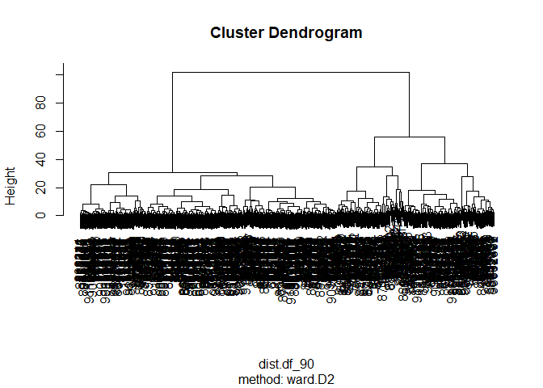

CLASS08
================
Joshua Lau

## Preparing the data

``` r
# Save your input data file into your Project directory
fna.data <- "WisconsinCancer.csv"

# Complete the following code to input the data and store as wisc.df
wisc.df <- read.csv(fna.data, row.names=1)

head(wisc.df)
```

             diagnosis radius_mean texture_mean perimeter_mean area_mean
    842302           M       17.99        10.38         122.80    1001.0
    842517           M       20.57        17.77         132.90    1326.0
    84300903         M       19.69        21.25         130.00    1203.0
    84348301         M       11.42        20.38          77.58     386.1
    84358402         M       20.29        14.34         135.10    1297.0
    843786           M       12.45        15.70          82.57     477.1
             smoothness_mean compactness_mean concavity_mean concave.points_mean
    842302           0.11840          0.27760         0.3001             0.14710
    842517           0.08474          0.07864         0.0869             0.07017
    84300903         0.10960          0.15990         0.1974             0.12790
    84348301         0.14250          0.28390         0.2414             0.10520
    84358402         0.10030          0.13280         0.1980             0.10430
    843786           0.12780          0.17000         0.1578             0.08089
             symmetry_mean fractal_dimension_mean radius_se texture_se perimeter_se
    842302          0.2419                0.07871    1.0950     0.9053        8.589
    842517          0.1812                0.05667    0.5435     0.7339        3.398
    84300903        0.2069                0.05999    0.7456     0.7869        4.585
    84348301        0.2597                0.09744    0.4956     1.1560        3.445
    84358402        0.1809                0.05883    0.7572     0.7813        5.438
    843786          0.2087                0.07613    0.3345     0.8902        2.217
             area_se smoothness_se compactness_se concavity_se concave.points_se
    842302    153.40      0.006399        0.04904      0.05373           0.01587
    842517     74.08      0.005225        0.01308      0.01860           0.01340
    84300903   94.03      0.006150        0.04006      0.03832           0.02058
    84348301   27.23      0.009110        0.07458      0.05661           0.01867
    84358402   94.44      0.011490        0.02461      0.05688           0.01885
    843786     27.19      0.007510        0.03345      0.03672           0.01137
             symmetry_se fractal_dimension_se radius_worst texture_worst
    842302       0.03003             0.006193        25.38         17.33
    842517       0.01389             0.003532        24.99         23.41
    84300903     0.02250             0.004571        23.57         25.53
    84348301     0.05963             0.009208        14.91         26.50
    84358402     0.01756             0.005115        22.54         16.67
    843786       0.02165             0.005082        15.47         23.75
             perimeter_worst area_worst smoothness_worst compactness_worst
    842302            184.60     2019.0           0.1622            0.6656
    842517            158.80     1956.0           0.1238            0.1866
    84300903          152.50     1709.0           0.1444            0.4245
    84348301           98.87      567.7           0.2098            0.8663
    84358402          152.20     1575.0           0.1374            0.2050
    843786            103.40      741.6           0.1791            0.5249
             concavity_worst concave.points_worst symmetry_worst
    842302            0.7119               0.2654         0.4601
    842517            0.2416               0.1860         0.2750
    84300903          0.4504               0.2430         0.3613
    84348301          0.6869               0.2575         0.6638
    84358402          0.4000               0.1625         0.2364
    843786            0.5355               0.1741         0.3985
             fractal_dimension_worst
    842302                   0.11890
    842517                   0.08902
    84300903                 0.08758
    84348301                 0.17300
    84358402                 0.07678
    843786                   0.12440

``` r
#let us remove the diagnosis column from our dataset
wisc.data <- wisc.df[,-1]

#but save it into another varaiable just in case
diagnosis <- factor(wisc.df$diagnosis)
```

## Q1 How many observations are in this dataset?

``` r
nrow(wisc.data)
```

    [1] 569

**569 observations are in this dataset**

## Q2: How many of the observations have a malignant diagnosis?

``` r
table(diagnosis)
```

    diagnosis
      B   M 
    357 212 

**212 observations are diagnosed malignant**

## Q3: How many variables/features in the data are suffixed with \_mean?

``` r
paste(length(grep("_mean", colnames(wisc.df))), "variables are suffixed with _mean, which are:")
```

    [1] "10 variables are suffixed with _mean, which are:"

``` r
colnames(wisc.df)[grep("_mean", colnames(wisc.df))]
```

     [1] "radius_mean"            "texture_mean"           "perimeter_mean"        
     [4] "area_mean"              "smoothness_mean"        "compactness_mean"      
     [7] "concavity_mean"         "concave.points_mean"    "symmetry_mean"         
    [10] "fractal_dimension_mean"

#### 10 variables are suffixed with `_mean`

# 2. PCA

Let’s see if we need to scale the data before PCA, by looking at the
distribution of the variables

``` r
colMeans(wisc.data)
```

                radius_mean            texture_mean          perimeter_mean 
               1.412729e+01            1.928965e+01            9.196903e+01 
                  area_mean         smoothness_mean        compactness_mean 
               6.548891e+02            9.636028e-02            1.043410e-01 
             concavity_mean     concave.points_mean           symmetry_mean 
               8.879932e-02            4.891915e-02            1.811619e-01 
     fractal_dimension_mean               radius_se              texture_se 
               6.279761e-02            4.051721e-01            1.216853e+00 
               perimeter_se                 area_se           smoothness_se 
               2.866059e+00            4.033708e+01            7.040979e-03 
             compactness_se            concavity_se       concave.points_se 
               2.547814e-02            3.189372e-02            1.179614e-02 
                symmetry_se    fractal_dimension_se            radius_worst 
               2.054230e-02            3.794904e-03            1.626919e+01 
              texture_worst         perimeter_worst              area_worst 
               2.567722e+01            1.072612e+02            8.805831e+02 
           smoothness_worst       compactness_worst         concavity_worst 
               1.323686e-01            2.542650e-01            2.721885e-01 
       concave.points_worst          symmetry_worst fractal_dimension_worst 
               1.146062e-01            2.900756e-01            8.394582e-02 

``` r
apply(wisc.data,2,sd)
```

                radius_mean            texture_mean          perimeter_mean 
               3.524049e+00            4.301036e+00            2.429898e+01 
                  area_mean         smoothness_mean        compactness_mean 
               3.519141e+02            1.406413e-02            5.281276e-02 
             concavity_mean     concave.points_mean           symmetry_mean 
               7.971981e-02            3.880284e-02            2.741428e-02 
     fractal_dimension_mean               radius_se              texture_se 
               7.060363e-03            2.773127e-01            5.516484e-01 
               perimeter_se                 area_se           smoothness_se 
               2.021855e+00            4.549101e+01            3.002518e-03 
             compactness_se            concavity_se       concave.points_se 
               1.790818e-02            3.018606e-02            6.170285e-03 
                symmetry_se    fractal_dimension_se            radius_worst 
               8.266372e-03            2.646071e-03            4.833242e+00 
              texture_worst         perimeter_worst              area_worst 
               6.146258e+00            3.360254e+01            5.693570e+02 
           smoothness_worst       compactness_worst         concavity_worst 
               2.283243e-02            1.573365e-01            2.086243e-01 
       concave.points_worst          symmetry_worst fractal_dimension_worst 
               6.573234e-02            6.186747e-02            1.806127e-02 

Since the variables have different distributions, let’s try scaling our
data

``` r
wisc.data.scaled <- as.data.frame(scale(wisc.data))
```

The variables should now be centered around \~0 with a sd of \~1 now

``` r
head(colMeans(wisc.data.scaled))
```

         radius_mean     texture_mean   perimeter_mean        area_mean 
       -1.383450e-16     6.151104e-17    -1.193179e-16     1.219428e-16 
     smoothness_mean compactness_mean 
        1.620945e-16    -7.617540e-17 

``` r
head(apply(wisc.data.scaled,2,sd))
```

         radius_mean     texture_mean   perimeter_mean        area_mean 
                   1                1                1                1 
     smoothness_mean compactness_mean 
                   1                1 

looks good!

Now we execute PCA and look at the summary

``` r
wisc.pr <- prcomp( wisc.data.scaled )
summary(wisc.pr)
```

    Importance of components:
                              PC1    PC2     PC3     PC4     PC5     PC6     PC7
    Standard deviation     3.6444 2.3857 1.67867 1.40735 1.28403 1.09880 0.82172
    Proportion of Variance 0.4427 0.1897 0.09393 0.06602 0.05496 0.04025 0.02251
    Cumulative Proportion  0.4427 0.6324 0.72636 0.79239 0.84734 0.88759 0.91010
                               PC8    PC9    PC10   PC11    PC12    PC13    PC14
    Standard deviation     0.69037 0.6457 0.59219 0.5421 0.51104 0.49128 0.39624
    Proportion of Variance 0.01589 0.0139 0.01169 0.0098 0.00871 0.00805 0.00523
    Cumulative Proportion  0.92598 0.9399 0.95157 0.9614 0.97007 0.97812 0.98335
                              PC15    PC16    PC17    PC18    PC19    PC20   PC21
    Standard deviation     0.30681 0.28260 0.24372 0.22939 0.22244 0.17652 0.1731
    Proportion of Variance 0.00314 0.00266 0.00198 0.00175 0.00165 0.00104 0.0010
    Cumulative Proportion  0.98649 0.98915 0.99113 0.99288 0.99453 0.99557 0.9966
                              PC22    PC23   PC24    PC25    PC26    PC27    PC28
    Standard deviation     0.16565 0.15602 0.1344 0.12442 0.09043 0.08307 0.03987
    Proportion of Variance 0.00091 0.00081 0.0006 0.00052 0.00027 0.00023 0.00005
    Cumulative Proportion  0.99749 0.99830 0.9989 0.99942 0.99969 0.99992 0.99997
                              PC29    PC30
    Standard deviation     0.02736 0.01153
    Proportion of Variance 0.00002 0.00000
    Cumulative Proportion  1.00000 1.00000

## Q4. From your results, what proportion of the original variance is captured by the first principal components (PC1)?

**From the summary table above, 44.27% of the original variance is
captured by PC1**

## Q5. How many principal components (PCs) are required to describe at least 70% of the original variance in the data?

**From the summary table above, looking at the cumulative proportion, 3
principal components are needed to describe 70% of the original variance
in the data (PC1, PC2, PC3 contribute to 72.6%)**

## Q6. How many principal components (PCs) are required to describe at least 90% of the original variance in the data?

**From the summary table above, looking at the cumulative proportion, 7
principal components are needed to describe 90% of the original variance
in the data (PC1, PC2, PC3, PC4, PC5, PC6, and PC7 contribute to
91.0%)**

# Interpreting PCA Results

``` r
biplot(wisc.pr)
```


## Q7. What stands out to you about this plot? Is it easy or difficult to understand? Why?

**It stands out to me that I cannot interpret much about the dataset
from this biplot. There is far too much text and labelling due to the
large number of observations and thus everything is overlapping and
nothing is legible**

Let’s plot a better scatterplot for PC1 and PC2

``` r
plot(wisc.pr$x, col = diagnosis , 
     xlab = "PC1", ylab = "PC2")
```


And for PC1 and PC3

``` r
plot(wisc.pr$x[,-2], col = diagnosis , 
     xlab = "PC1", ylab = "PC3")
```


## Q8. Generate a similar plot for principal components 1 and 3. What do you notice about these plots?

**I notice that PC1 and PC2/PC3 are able to segragate the Benign and
Malignant samples quite well based on the data. This is seen from how
there are two distinct/separated groups of colored points which are
based on the diagnosis by the physician. I see that the plot of PC1 and
PC2 separates these two conditions slightly better which makes sense as
PC2 accounts for more of the variation within the data.**

Let’s try using ggplot to create better plots

``` r
df <- as.data.frame(wisc.pr$x)
df$diagnosis <- diagnosis

# Load the ggplot2 package
library(ggplot2)
```

    Warning: package 'ggplot2' was built under R version 4.0.5

``` r
# Make a scatter plot colored by diagnosis
ggplot(df) + 
  aes(PC1, PC2, col=diagnosis) + 
  geom_point()
```


# Variance Explained

``` r
# Calculate variance of each component
pr.var <- wisc.pr$sdev^2 
head(pr.var)
```

    [1] 13.281608  5.691355  2.817949  1.980640  1.648731  1.207357

``` r
#divide by the sum of variances
pve <- pr.var/ sum(wisc.pr$sdev^2)
head(pve)
```

    [1] 0.44272026 0.18971182 0.09393163 0.06602135 0.05495768 0.04024522

Plotting variance explained by each PC

``` r
plot(pve, xlab = "Principal Component", 
     ylab = "Proportion of Variance Explained", 
     ylim = c(0, 1), type = "o")
```


``` r
barplot(pve, ylab = "Precent of Variance Explained",
     names.arg=paste0("PC",1:length(pve)), las=2, axes = FALSE)
axis(2, at=pve, labels=round(pve,2)*100 )
```


## Q9. For the first principal component, what is the component of the loading vector (i.e. wisc.pr\$rotation\[,1\]) for the feature concave.points_mean?

``` r
wisc.pr$rotation[,1]["concave.points_mean"]
```

    concave.points_mean 
             -0.2608538 

## Q10 What is the minimum number of principal components required to explain 80% of the variance of the data?

``` r
sum(pve[1:4])
```

    [1] 0.7923851

``` r
sum(pve[1:5])
```

    [1] 0.8473427

**5 principal components are needed to describe 90% of the original
variance in the data (PC1, PC2, PC3, PC4, PC5 together contribute to
84.0% of the original variation)**

# Hierarchial Clustering

Scaling data and calculating pairwise distance matrix and performing
`hclust()`

``` r
data.scaled <- scale(wisc.data)

data.dist <- dist(data.scaled)

wisc.hclust <- hclust(data.dist, method = "complete")
```

## Q11. Using the plot() and abline() functions, what is the height at which the clustering model has 4 clusters?

plotting results

``` r
plot(wisc.hclust, sub = "method: complete")
abline(h=19, col="red", lty =2)
```


**19 is one value of height for which the dendrogram is segregated into
4 custers**

## Selecting number of clusters

``` r
wisc.hclust.clusters <- cutree(wisc.hclust, k=4)

table(wisc.hclust.clusters, diagnosis)
```

                        diagnosis
    wisc.hclust.clusters   B   M
                       1  12 165
                       2   2   5
                       3 343  40
                       4   0   2

## Q12 Can you find a better cluster vs diagnoses match by cutting into a different number of clusters between 2 and 10?

``` r
wisc.hclust.clusters_3 <- cutree(wisc.hclust, k=3)

table(wisc.hclust.clusters_3, diagnosis)
```

                          diagnosis
    wisc.hclust.clusters_3   B   M
                         1 355 205
                         2   2   5
                         3   0   2

``` r
wisc.hclust.clusters_10 <- cutree(wisc.hclust, k=10)

table(wisc.hclust.clusters_10, diagnosis)
```

                           diagnosis
    wisc.hclust.clusters_10   B   M
                         1   12  86
                         2    0  59
                         3    0   3
                         4  331  39
                         5    0  20
                         6    2   0
                         7   12   0
                         8    0   2
                         9    0   2
                         10   0   1

**We see that for k\<4 there is poor separation of clusters into benign
and malignant groups. Therefore, k=4 is the minimum number of clusters
needed to separate these two conditions. However, as we increase k
beyond 4, up until even k=10 we see that there is only a very marignal
improvement in the separation of these B and M clusters. Therefore, k=4
should be an optimal number of clusters for this data.**

## Q13. Which method gives your favorite results for the same data.dist dataset? Explain your reasoning.

## Using different methods

``` r
plot(hclust(data.dist, method = "single"), sub = "method: single")
```


``` r
plot(hclust(data.dist, method = "complete"), sub = "method: complete")
```


``` r
plot(hclust(data.dist, method = "average"), sub = "method: average")
```


``` r
plot(hclust(data.dist, method = "ward.D2"), sub = "method: ward.D2")
```


``` r
#examining the ward.D2 method better
wisc.hclust.clusters.ward <- cutree(hclust(data.dist, method = "ward.D2"), k=2)

table(wisc.hclust.clusters.ward, diagnosis)
```

                             diagnosis
    wisc.hclust.clusters.ward   B   M
                            1  20 164
                            2 337  48

``` r
table(wisc.hclust.clusters, diagnosis)
```

                        diagnosis
    wisc.hclust.clusters   B   M
                       1  12 165
                       2   2   5
                       3 343  40
                       4   0   2

**the method ward.D2 looks the best to me because there is a clear
separation of the two clusters in the dataset, which represent the two
disease conditions (B/M) quite well, as seen in the table above. It is
good to have the number of clusters equal to the number of diagnostic
conditions as that means that the data naturally segregates in such a
way that supports the initial diagnosis. On the other hand, looking at
the dendrograms obtained using the other methods, it seems that more
clusters (a higher k) are necessary before the same level of separation
is achieved. With that being said, if the desired measure is accuracy
then the original method of “complete” works best as it only produces 14
misdiagnosed benign samples (12 from grp 1 and 2 from grp 2), and 40
misdiagnosed malignant samples from grp 3. However, a limitation with
more clusters is that when you have small cluster sizes with not very
distinct separation, e.g. clusters 2 and 4, you cannot be statistically
very certain as to whether or not such a cluster actually represents, in
this case,the M diagnosis, and it is more likely that clusters 2 and 4
should be assigned an “unknown” diagnosis**

# k-means

``` r
wisc.km <- kmeans(data.scaled, centers= 2, nstart= 20)

table(wisc.km$cluster, diagnosis)
```

       diagnosis
          B   M
      1  14 175
      2 343  37

## Q14. How well does k-means separate the two diagnoses? How does it compare to your hclust results?

**k-means performs reasonably well to separate the two diagnoses, with
343 true positives and 175 true negatives, and only 37 false negatives
and 14 false positives. It is slightly improved over the hclust results
from ward.D2 method which yields slightly poorer truth measures (TP =
337, TN = 164, FP = 20, FN = 48).**

# 5. Combining methods

## Clustering on PCA results

Create a hclust model of the PCs that describe 90% of the variability of
the data with `method = "ward.D2"`

``` r
summary(wisc.pr) 
```

    Importance of components:
                              PC1    PC2     PC3     PC4     PC5     PC6     PC7
    Standard deviation     3.6444 2.3857 1.67867 1.40735 1.28403 1.09880 0.82172
    Proportion of Variance 0.4427 0.1897 0.09393 0.06602 0.05496 0.04025 0.02251
    Cumulative Proportion  0.4427 0.6324 0.72636 0.79239 0.84734 0.88759 0.91010
                               PC8    PC9    PC10   PC11    PC12    PC13    PC14
    Standard deviation     0.69037 0.6457 0.59219 0.5421 0.51104 0.49128 0.39624
    Proportion of Variance 0.01589 0.0139 0.01169 0.0098 0.00871 0.00805 0.00523
    Cumulative Proportion  0.92598 0.9399 0.95157 0.9614 0.97007 0.97812 0.98335
                              PC15    PC16    PC17    PC18    PC19    PC20   PC21
    Standard deviation     0.30681 0.28260 0.24372 0.22939 0.22244 0.17652 0.1731
    Proportion of Variance 0.00314 0.00266 0.00198 0.00175 0.00165 0.00104 0.0010
    Cumulative Proportion  0.98649 0.98915 0.99113 0.99288 0.99453 0.99557 0.9966
                              PC22    PC23   PC24    PC25    PC26    PC27    PC28
    Standard deviation     0.16565 0.15602 0.1344 0.12442 0.09043 0.08307 0.03987
    Proportion of Variance 0.00091 0.00081 0.0006 0.00052 0.00027 0.00023 0.00005
    Cumulative Proportion  0.99749 0.99830 0.9989 0.99942 0.99969 0.99992 0.99997
                              PC29    PC30
    Standard deviation     0.02736 0.01153
    Proportion of Variance 0.00002 0.00000
    Cumulative Proportion  1.00000 1.00000

PC1 - PC7 is needed to account for 90% of the variation

``` r
df_90 <- wisc.pr$x[,1:7]
dist.df_90 <- dist(df_90)
```

``` r
wisc.pr.hclust <- hclust(dist.df_90, method = "ward.D2")
plot(wisc.pr.hclust, sub = "method: ward.D2")
```



looking at two main branches, compare results to ground truth of actual
diagnosis

``` r
grps_2 <- cutree(wisc.pr.hclust, k=2)
table(grps_2,diagnosis)
```

          diagnosis
    grps_2   B   M
         1  28 188
         2 329  24

## Q15. How well does the newly created model with four clusters separate out the two diagnoses?

``` r
grps_4 <- cutree(wisc.pr.hclust, k=4)
table(grps_4,diagnosis)
```

          diagnosis
    grps_4   B   M
         1   0  45
         2   2  77
         3  26  66
         4 329  24

**This newly created model with 4 clusters performs the same as the
original model with 2 clusters. If we consider that clusters 1,2, and 3
represent the M diagnosis; and cluster 4 represents the B diagnosis, we
can still see that there are 28 (2 from grp 2 and 26 from grp 3) benign
samples assigned to a malignant cluster, and still 24 (all from grp 4)
malignant samples assigned to benign cluster (cluster 4)**

## Q16 How well do the k-means and hierarchical clustering models you created in previous sections (i.e. before PCA) do in terms of separating the diagnoses? Again, use the table() function to compare the output of each model (wisc.km\$cluster and wisc.hclust.clusters) with the vector containing the actual diagnoses.

``` r
table(grps_2,diagnosis)
```

          diagnosis
    grps_2   B   M
         1  28 188
         2 329  24

``` r
table(wisc.km$cluster, diagnosis)
```

       diagnosis
          B   M
      1  14 175
      2 343  37

``` r
table(wisc.hclust.clusters.ward, diagnosis)
```

                             diagnosis
    wisc.hclust.clusters.ward   B   M
                            1  20 164
                            2 337  48

``` r
table(wisc.hclust.clusters, diagnosis)
```

                        diagnosis
    wisc.hclust.clusters   B   M
                       1  12 165
                       2   2   5
                       3 343  40
                       4   0   2

**It appears that these methods, whether it be the hclust on the PCA,
the hclust with ward.D2 method, or the hclust with the complete method,
all perform rather similarly achieving a relatively good separation of
the B and M diagnoses**

## Q17. Which of your analysis procedures resulted in a clustering model with the best specificity? How about sensitivity?

**FN: Predicted B, is M** **FP: Predicted M, is B**

Looking at the combined PCA(90%) -\> hclust model first

``` r
table(grps_2,diagnosis)
```

          diagnosis
    grps_2   B   M
         1  28 188
         2 329  24

``` r
sens_1 <- 188/(188+28)
spec_1 <- 329/(329+24)

sens_1
```

    [1] 0.8703704

``` r
spec_1
```

    [1] 0.9320113

Then the kmeans model (k=2)

``` r
table(wisc.km$cluster, diagnosis)
```

       diagnosis
          B   M
      1  14 175
      2 343  37

``` r
sens_2 <- 175/(175+14)
spec_2 <- 343/(343+37)

sens_2
```

    [1] 0.9259259

``` r
spec_2
```

    [1] 0.9026316

Then the hclust model with method = ward.D2 and k = 2

``` r
table(wisc.hclust.clusters.ward, diagnosis)
```

                             diagnosis
    wisc.hclust.clusters.ward   B   M
                            1  20 164
                            2 337  48

``` r
sens_3 <- 164/(164+20)
spec_3 <- 337/(337+48)

sens_3
```

    [1] 0.8913043

``` r
spec_3
```

    [1] 0.8753247

then the hclust model with complete method and k = 4. (Let clusters 2
and 4 be assigned to M)

``` r
table(wisc.hclust.clusters, diagnosis)
```

                        diagnosis
    wisc.hclust.clusters   B   M
                       1  12 165
                       2   2   5
                       3 343  40
                       4   0   2

``` r
sens_4 <- (165+5+2)/(165+5+2+12+2+0)
spec_4 <- (343) / (343+40)

sens_4
```

    [1] 0.9247312

``` r
spec_4
```

    [1] 0.8955614

**it appears that the model with the highest specificity is the first
model, which performs a hclust with the method ward.D2 on the first 7
Principal Components of the PCA. It has a specificity of 93.2 %. The
model with the highest sensitivity is the kmeans model (k=2) with a
sensitivity of 92.59 %**

# 7. Prediction

We will use the predict() function that will take our PCA model from
before and new cancer cell data and project that data onto our PCA
space.

``` r
url <- "https://tinyurl.com/new-samples-CSV"
new <- read.csv(url)
#need to scale data first as wisc.pr was trained on scaled data
new.scaled <- scale(new, center = colMeans(wisc.data), scale = apply(wisc.data,2,sd))
npc <- predict(wisc.pr, newdata=new.scaled)
head(npc)
```

               PC1       PC2        PC3        PC4       PC5        PC6        PC7
    [1,]  2.576616 -3.135913  1.3990492 -0.7631950  2.781648 -0.8150185 -0.3959098
    [2,] -4.754928 -3.009033 -0.1660946 -0.6052952 -1.140698 -1.2189945  0.8193031
                PC8       PC9       PC10      PC11      PC12      PC13     PC14
    [1,] -0.2307350 0.1029569 -0.9272861 0.3411457  0.375921 0.1610764 1.187882
    [2,] -0.3307423 0.5281896 -0.4855301 0.7173233 -1.185917 0.5893856 0.303029
              PC15       PC16        PC17        PC18        PC19       PC20
    [1,] 0.3216974 -0.1743616 -0.07875393 -0.11207028 -0.08802955 -0.2495216
    [2,] 0.1299153  0.1448061 -0.40509706  0.06565549  0.25591230 -0.4289500
               PC21       PC22       PC23       PC24        PC25         PC26
    [1,]  0.1228233 0.09358453 0.08347651  0.1223396  0.02124121  0.078884581
    [2,] -0.1224776 0.01732146 0.06316631 -0.2338618 -0.20755948 -0.009833238
                 PC27        PC28         PC29         PC30
    [1,]  0.220199544 -0.02946023 -0.015620933  0.005269029
    [2,] -0.001134152  0.09638361  0.002795349 -0.019015820

``` r
plot(wisc.pr$x[,1:2], col = diagnosis)
points(npc[,1], npc[,2], col="blue", pch=16, cex=3)
text(npc[,1], npc[,2], c(1,2), col="white")
```


## Q18. Which of these new patients should we prioritize for follow up based on your results?

**Based on our new results, we should prioritize follow up of Patient 2
as they fall into the red (malignant) cluster based on the PCA
transformation**
