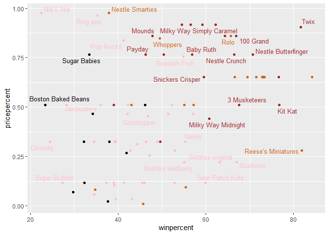

class10
================
Joshua Lau

``` r
library(tidyverse)
```

    -- Attaching packages --------------------------------------- tidyverse 1.3.2 --
    v ggplot2 3.3.5     v purrr   0.3.4
    v tibble  3.1.6     v dplyr   1.0.8
    v tidyr   1.2.0     v stringr 1.4.0
    v readr   2.1.2     v forcats 1.0.0

    Warning: package 'ggplot2' was built under R version 4.0.5

    Warning: package 'tibble' was built under R version 4.0.5

    Warning: package 'tidyr' was built under R version 4.0.5

    Warning: package 'readr' was built under R version 4.0.5

    Warning: package 'purrr' was built under R version 4.0.5

    Warning: package 'dplyr' was built under R version 4.0.5

    Warning: package 'stringr' was built under R version 4.0.5

    -- Conflicts ------------------------------------------ tidyverse_conflicts() --
    x dplyr::filter() masks stats::filter()
    x dplyr::lag()    masks stats::lag()

``` r
library(skimr)
```

Importing candy data

``` r
candy_file <- "https://raw.githubusercontent.com/fivethirtyeight/data/master/candy-power-ranking/candy-data.csv"

candy = read.csv(url(candy_file), row.names=1)
head(candy)
```

                 chocolate fruity caramel peanutyalmondy nougat crispedricewafer
    100 Grand            1      0       1              0      0                1
    3 Musketeers         1      0       0              0      1                0
    One dime             0      0       0              0      0                0
    One quarter          0      0       0              0      0                0
    Air Heads            0      1       0              0      0                0
    Almond Joy           1      0       0              1      0                0
                 hard bar pluribus sugarpercent pricepercent winpercent
    100 Grand       0   1        0        0.732        0.860   66.97173
    3 Musketeers    0   1        0        0.604        0.511   67.60294
    One dime        0   0        0        0.011        0.116   32.26109
    One quarter     0   0        0        0.011        0.511   46.11650
    Air Heads       0   0        0        0.906        0.511   52.34146
    Almond Joy      0   1        0        0.465        0.767   50.34755

### Q1

``` r
length(rownames(candy))
```

    [1] 85

**there are 85 types of candy**

### Q2

``` r
sum(candy$fruity)
```

    [1] 38

**there are 38 types of fruity candy**

### Q3

My favourite is Hershey’s Kisses

``` r
candy["Hershey's Kisses", ]$winpercent
```

    [1] 55.37545

**The win percent is 55.37%** \### Q4

``` r
candy["Kit Kat", ]$winpercent
```

    [1] 76.7686

**The win percent is 76.77%**

### Q5

My favourite is Hershey’s Kisses

``` r
candy["Tootsie Roll Snack Bars", ]$winpercent
```

    [1] 49.6535

**The win percent is 49.65%**

``` r
skim(candy)
```

|                                                  |       |
|:-------------------------------------------------|:------|
| Name                                             | candy |
| Number of rows                                   | 85    |
| Number of columns                                | 12    |
| \_\_\_\_\_\_\_\_\_\_\_\_\_\_\_\_\_\_\_\_\_\_\_   |       |
| Column type frequency:                           |       |
| numeric                                          | 12    |
| \_\_\_\_\_\_\_\_\_\_\_\_\_\_\_\_\_\_\_\_\_\_\_\_ |       |
| Group variables                                  | None  |

Data summary

**Variable type: numeric**

| skim_variable    | n_missing | complete_rate |  mean |    sd |    p0 |   p25 |   p50 |   p75 |  p100 | hist  |
|:-----------------|----------:|--------------:|------:|------:|------:|------:|------:|------:|------:|:------|
| chocolate        |         0 |             1 |  0.44 |  0.50 |  0.00 |  0.00 |  0.00 |  1.00 |  1.00 | ▇▁▁▁▆ |
| fruity           |         0 |             1 |  0.45 |  0.50 |  0.00 |  0.00 |  0.00 |  1.00 |  1.00 | ▇▁▁▁▆ |
| caramel          |         0 |             1 |  0.16 |  0.37 |  0.00 |  0.00 |  0.00 |  0.00 |  1.00 | ▇▁▁▁▂ |
| peanutyalmondy   |         0 |             1 |  0.16 |  0.37 |  0.00 |  0.00 |  0.00 |  0.00 |  1.00 | ▇▁▁▁▂ |
| nougat           |         0 |             1 |  0.08 |  0.28 |  0.00 |  0.00 |  0.00 |  0.00 |  1.00 | ▇▁▁▁▁ |
| crispedricewafer |         0 |             1 |  0.08 |  0.28 |  0.00 |  0.00 |  0.00 |  0.00 |  1.00 | ▇▁▁▁▁ |
| hard             |         0 |             1 |  0.18 |  0.38 |  0.00 |  0.00 |  0.00 |  0.00 |  1.00 | ▇▁▁▁▂ |
| bar              |         0 |             1 |  0.25 |  0.43 |  0.00 |  0.00 |  0.00 |  0.00 |  1.00 | ▇▁▁▁▂ |
| pluribus         |         0 |             1 |  0.52 |  0.50 |  0.00 |  0.00 |  1.00 |  1.00 |  1.00 | ▇▁▁▁▇ |
| sugarpercent     |         0 |             1 |  0.48 |  0.28 |  0.01 |  0.22 |  0.47 |  0.73 |  0.99 | ▇▇▇▇▆ |
| pricepercent     |         0 |             1 |  0.47 |  0.29 |  0.01 |  0.26 |  0.47 |  0.65 |  0.98 | ▇▇▇▇▆ |
| winpercent       |         0 |             1 | 50.32 | 14.71 | 22.45 | 39.14 | 47.83 | 59.86 | 84.18 | ▃▇▆▅▂ |

### Q6

**the winpercent variable is on a different scale ot the other
variables. it ranges from 0 to \~84, unlike the other variables scaling
from 0 to 1.**

### Q7

**1 represents that the candy in question contains chocolate, and 0
represents that the candy does not contain chocolate.**

### Q8

``` r
hist(candy$winpercent)
```


### Q9

**the distribution of winpercents is not symmetrical. it seems that it
is somewhat positively skewed**

### Q10

**the mean is below 50%**

### Q11

``` r
mean(candy[candy$chocolate==1,]$winpercent)
```

    [1] 60.92153

``` r
mean(candy[candy$fruity==1,]$winpercent)
```

    [1] 44.11974

Chocolate is on average higher ranked

### Q12

``` r
t.test(candy[candy$chocolate==1,]$winpercent, candy[candy$fruity==1,]$winpercent)
```


        Welch Two Sample t-test

    data:  candy[candy$chocolate == 1, ]$winpercent and candy[candy$fruity == 1, ]$winpercent
    t = 6.2582, df = 68.882, p-value = 2.871e-08
    alternative hypothesis: true difference in means is not equal to 0
    95 percent confidence interval:
     11.44563 22.15795
    sample estimates:
    mean of x mean of y 
     60.92153  44.11974 

**as p = 2.871e-08 \< 0.05, the difference is significant**

### Q13

``` r
candy %>% arrange(winpercent) %>% head(5)
```

                       chocolate fruity caramel peanutyalmondy nougat
    Nik L Nip                  0      1       0              0      0
    Boston Baked Beans         0      0       0              1      0
    Chiclets                   0      1       0              0      0
    Super Bubble               0      1       0              0      0
    Jawbusters                 0      1       0              0      0
                       crispedricewafer hard bar pluribus sugarpercent pricepercent
    Nik L Nip                         0    0   0        1        0.197        0.976
    Boston Baked Beans                0    0   0        1        0.313        0.511
    Chiclets                          0    0   0        1        0.046        0.325
    Super Bubble                      0    0   0        0        0.162        0.116
    Jawbusters                        0    1   0        1        0.093        0.511
                       winpercent
    Nik L Nip            22.44534
    Boston Baked Beans   23.41782
    Chiclets             24.52499
    Super Bubble         27.30386
    Jawbusters           28.12744

**the 5 least liked candy types are Nik L Nip, Boston baked beans,
Chiclets, super bubble, and jawbusters**

### Q14

``` r
candy %>% arrange(desc(winpercent)) %>% head(5)
```

                              chocolate fruity caramel peanutyalmondy nougat
    Reese's Peanut Butter cup         1      0       0              1      0
    Reese's Miniatures                1      0       0              1      0
    Twix                              1      0       1              0      0
    Kit Kat                           1      0       0              0      0
    Snickers                          1      0       1              1      1
                              crispedricewafer hard bar pluribus sugarpercent
    Reese's Peanut Butter cup                0    0   0        0        0.720
    Reese's Miniatures                       0    0   0        0        0.034
    Twix                                     1    0   1        0        0.546
    Kit Kat                                  1    0   1        0        0.313
    Snickers                                 0    0   1        0        0.546
                              pricepercent winpercent
    Reese's Peanut Butter cup        0.651   84.18029
    Reese's Miniatures               0.279   81.86626
    Twix                             0.906   81.64291
    Kit Kat                          0.511   76.76860
    Snickers                         0.651   76.67378

**5 most liked candys are reese’s peanut butter cup, reese’s miniatures,
twix, kit kat, and snickers**

### Q15

``` r
library(ggplot2)

ggplot(candy) +
  aes(winpercent, rownames(candy)) + 
  geom_col()
```


### Q16

``` r
ggplot(candy) +
  aes(winpercent, reorder(rownames(candy),winpercent)) + 
  geom_col()
```


``` r
my_cols=rep("black", nrow(candy))
my_cols[as.logical(candy$chocolate)] = "chocolate"
my_cols[as.logical(candy$bar)] = "brown"
my_cols[as.logical(candy$fruity)] = "pink"
```

``` r
ggplot(candy) + 
  aes(winpercent, reorder(rownames(candy),winpercent)) +
  geom_col(fill=my_cols) 
```


### Q17

**worst ranked chocolate candy is sixlets**

### Q18

**highest ranked fruity candy is starburst**

## Q19

``` r
library(ggrepel)
```

    Warning: package 'ggrepel' was built under R version 4.0.5

``` r
# How about a plot of price vs win
ggplot(candy) +
  aes(winpercent, pricepercent, label=rownames(candy)) +
  geom_point(col=my_cols) + 
  geom_text_repel(col=my_cols, size=3.3, max.overlaps = 5)
```

    Warning: ggrepel: 54 unlabeled data points (too many overlaps). Consider
    increasing max.overlaps



**the highest ranked candy for the least money is Reese’s Miniatures**

### Q20

**Top 5 most expensive candy types are Nik L Nip, Nestle Smarties, Ring
pop, hershey’s krackel, and hershey’s milk chocolate. the least popular
by winpercent is Nik L Nip**

``` r
ord <- order(candy$pricepercent, decreasing = TRUE)
head( candy[ord,c(11,12)], n=5 )
```

                             pricepercent winpercent
    Nik L Nip                       0.976   22.44534
    Nestle Smarties                 0.976   37.88719
    Ring pop                        0.965   35.29076
    Hershey's Krackel               0.918   62.28448
    Hershey's Milk Chocolate        0.918   56.49050

``` r
library(corrplot)
```

    corrplot 0.92 loaded

``` r
cij <- cor(candy)
corrplot(cij)
```


**negatively correlated variables include fruity and chocolate, or
pluribus and bar**

### Q23

**2 most positively correlate variables include chocolate and
winpercent, and chocolate and bar**

``` r
pca <- prcomp(candy, scale = TRUE)
summary(pca)
```

    Importance of components:
                              PC1    PC2    PC3     PC4    PC5     PC6     PC7
    Standard deviation     2.0788 1.1378 1.1092 1.07533 0.9518 0.81923 0.81530
    Proportion of Variance 0.3601 0.1079 0.1025 0.09636 0.0755 0.05593 0.05539
    Cumulative Proportion  0.3601 0.4680 0.5705 0.66688 0.7424 0.79830 0.85369
                               PC8     PC9    PC10    PC11    PC12
    Standard deviation     0.74530 0.67824 0.62349 0.43974 0.39760
    Proportion of Variance 0.04629 0.03833 0.03239 0.01611 0.01317
    Cumulative Proportion  0.89998 0.93832 0.97071 0.98683 1.00000

``` r
plot(pca$x[,c(1,2)], col = my_cols, pch = 16)
```


``` r
my_data <- cbind(candy, pca$x[,1:3])
p <- ggplot(my_data) + 
        aes(x=PC1, y=PC2, 
            size=winpercent/100,  
            text=rownames(my_data),
            label=rownames(my_data)) +
        geom_point(col=my_cols)


p + geom_text_repel(size=3.3, col=my_cols, max.overlaps = 7)  + 
  theme(legend.position = "none") +
  labs(title="Halloween Candy PCA Space",
       subtitle="Colored by type: chocolate bar (dark brown), chocolate other (light brown), fruity (red), other (black)",
       caption="Data from 538")
```

    Warning: ggrepel: 43 unlabeled data points (too many overlaps). Consider
    increasing max.overlaps


``` r
#library(plotly)
#ggplotly(p)
```

``` r
par(mar=c(8,4,2,2))
barplot(pca$rotation[,1], las=2, ylab="PC1 Contribution")
```


### Q24

**fruity, pluribus, and hard are picked up strongly by PC1 in the
positive direciton. This makes sense as all the fruity candy (colored
pink) are to the right of the pca plot, or the positive direction for
PC1. and we also know that pluribus and fruity are strongly correlated**
