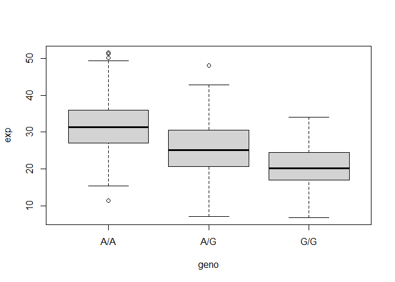

class11
================
Joshua Lau

``` r
library(tidyverse)
```

    -- Attaching packages --------------------------------------- tidyverse 1.3.2 --
    v ggplot2 3.3.5     v purrr   0.3.4
    v tibble  3.1.6     v dplyr   1.0.8
    v tidyr   1.2.0     v stringr 1.4.0
    v readr   2.1.2     v forcats 1.0.0

    Warning: package 'ggplot2' was built under R version 4.0.5

    Warning: package 'tibble' was built under R version 4.0.5

    Warning: package 'tidyr' was built under R version 4.0.5

    Warning: package 'readr' was built under R version 4.0.5

    Warning: package 'purrr' was built under R version 4.0.5

    Warning: package 'dplyr' was built under R version 4.0.5

    Warning: package 'stringr' was built under R version 4.0.5

    -- Conflicts ------------------------------------------ tidyverse_conflicts() --
    x dplyr::filter() masks stats::filter()
    x dplyr::lag()    masks stats::lag()

Reading the file into R

``` r
dat = read.table('rs8067378_ENSG00000172057.6.txt')
```

### Q13

Sample size for each genotype

``` r
table(factor(dat$geno))
```


    A/A A/G G/G 
    108 233 121 

Median expression for each genotype

``` r
dat %>% 
  group_by(geno) %>%
  summarize(median = median(exp))
```

    # A tibble: 3 x 2
      geno  median
      <chr>  <dbl>
    1 A/A     31.2
    2 A/G     25.1
    3 G/G     20.1

### Q14

``` r
boxplot(exp~geno, dat)
```



From the boxplot, we see that the genotype AA has the highest expression
of ORMDL3 with a median of \~30, and that the genotype GG has the lowest
expression of ORMDL3 with a median of \~20, with the heterozygous
genotype AG in between with an expression of \~25. This would seem to
indicate that the SNP in ORMDL3 affects the expression of the protein.
