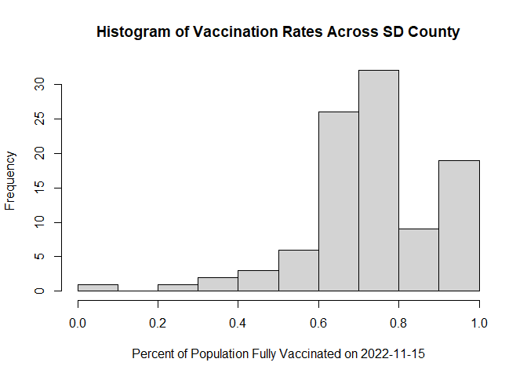
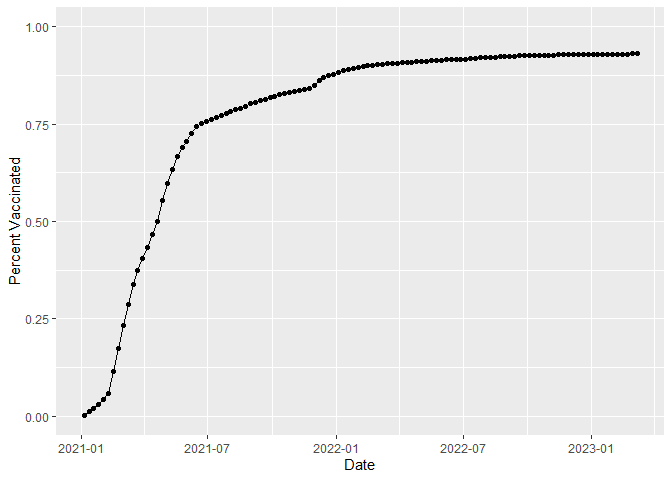
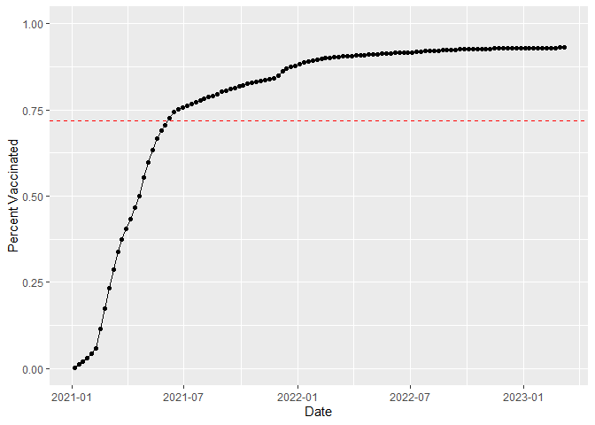
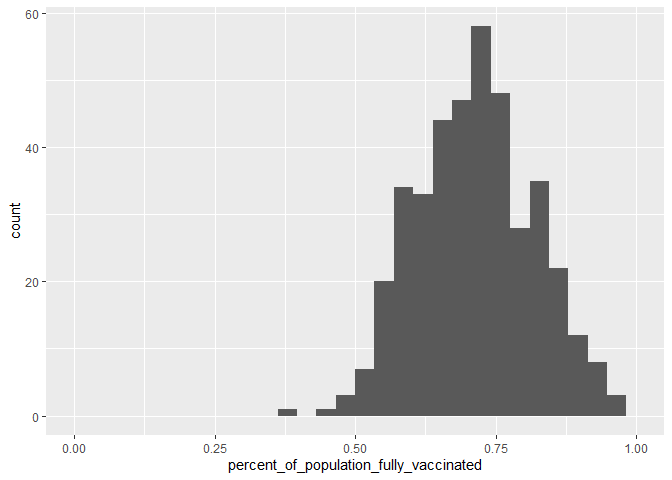
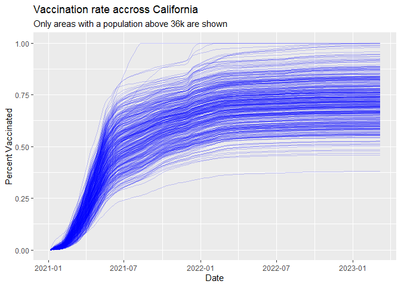

class17
================

``` r
library(tidyverse)
```

    -- Attaching packages --------------------------------------- tidyverse 1.3.2 --
    v ggplot2 3.3.5     v purrr   0.3.4
    v tibble  3.1.6     v dplyr   1.0.8
    v tidyr   1.2.0     v stringr 1.4.0
    v readr   2.1.2     v forcats 1.0.0

    Warning: package 'ggplot2' was built under R version 4.0.5

    Warning: package 'tibble' was built under R version 4.0.5

    Warning: package 'tidyr' was built under R version 4.0.5

    Warning: package 'readr' was built under R version 4.0.5

    Warning: package 'purrr' was built under R version 4.0.5

    Warning: package 'dplyr' was built under R version 4.0.5

    Warning: package 'stringr' was built under R version 4.0.5

    -- Conflicts ------------------------------------------ tidyverse_conflicts() --
    x dplyr::filter() masks stats::filter()
    x dplyr::lag()    masks stats::lag()

``` r
url <- "https://data.chhs.ca.gov/dataset/ead44d40-fd63-4f9f-950a-3b0111074de8/resource/ec32eece-7474-4488-87f0-6e91cb577458/download/covid19vaccinesbyzipcode_test.csv"

vax <- read.csv("covid19vaccinesbyzipcode_test.csv")
head(vax)
```

      as_of_date zip_code_tabulation_area local_health_jurisdiction          county
    1 2021-01-05                    93609                    Fresno          Fresno
    2 2021-01-05                    94086               Santa Clara     Santa Clara
    3 2021-01-05                    94304               Santa Clara     Santa Clara
    4 2021-01-05                    94110             San Francisco   San Francisco
    5 2021-01-05                    93420           San Luis Obispo San Luis Obispo
    6 2021-01-05                    93454             Santa Barbara   Santa Barbara
      vaccine_equity_metric_quartile                 vem_source
    1                              1 Healthy Places Index Score
    2                              4 Healthy Places Index Score
    3                              4 Healthy Places Index Score
    4                              4 Healthy Places Index Score
    5                              3 Healthy Places Index Score
    6                              2 Healthy Places Index Score
      age12_plus_population age5_plus_population tot_population
    1                4396.3                 4839           5177
    2               42696.0                46412          50477
    3                3263.5                 3576           3852
    4               64350.7                68320          72380
    5               26694.9                29253          30740
    6               32043.4                36446          40432
      persons_fully_vaccinated persons_partially_vaccinated
    1                       NA                           NA
    2                       11                          640
    3                       NA                           NA
    4                       18                         1262
    5                       NA                           NA
    6                       NA                           NA
      percent_of_population_fully_vaccinated
    1                                     NA
    2                               0.000218
    3                                     NA
    4                               0.000249
    5                                     NA
    6                                     NA
      percent_of_population_partially_vaccinated
    1                                         NA
    2                                   0.012679
    3                                         NA
    4                                   0.017436
    5                                         NA
    6                                         NA
      percent_of_population_with_1_plus_dose booster_recip_count
    1                                     NA                  NA
    2                               0.012897                  NA
    3                                     NA                  NA
    4                               0.017685                  NA
    5                                     NA                  NA
    6                                     NA                  NA
      bivalent_dose_recip_count eligible_recipient_count
    1                        NA                        1
    2                        NA                       11
    3                        NA                        6
    4                        NA                       18
    5                        NA                        4
    6                        NA                        5
                                                                   redacted
    1 Information redacted in accordance with CA state privacy requirements
    2 Information redacted in accordance with CA state privacy requirements
    3 Information redacted in accordance with CA state privacy requirements
    4 Information redacted in accordance with CA state privacy requirements
    5 Information redacted in accordance with CA state privacy requirements
    6 Information redacted in accordance with CA state privacy requirements

``` r
skimr::skim(vax)
```

|                                                  |        |
|:-------------------------------------------------|:-------|
| Name                                             | vax    |
| Number of rows                                   | 201096 |
| Number of columns                                | 18     |
| \_\_\_\_\_\_\_\_\_\_\_\_\_\_\_\_\_\_\_\_\_\_\_   |        |
| Column type frequency:                           |        |
| character                                        | 5      |
| numeric                                          | 13     |
| \_\_\_\_\_\_\_\_\_\_\_\_\_\_\_\_\_\_\_\_\_\_\_\_ |        |
| Group variables                                  | None   |

Data summary

**Variable type: character**

| skim_variable             | n_missing | complete_rate | min | max | empty | n_unique | whitespace |
|:--------------------------|----------:|--------------:|----:|----:|------:|---------:|-----------:|
| as_of_date                |         0 |             1 |  10 |  10 |     0 |      114 |          0 |
| local_health_jurisdiction |         0 |             1 |   0 |  15 |   570 |       62 |          0 |
| county                    |         0 |             1 |   0 |  15 |   570 |       59 |          0 |
| vem_source                |         0 |             1 |  15 |  26 |     0 |        3 |          0 |
| redacted                  |         0 |             1 |   2 |  69 |     0 |        2 |          0 |

**Variable type: numeric**

| skim_variable                              | n_missing | complete_rate |     mean |       sd |    p0 |      p25 |      p50 |      p75 |     p100 | hist  |
|:-------------------------------------------|----------:|--------------:|---------:|---------:|------:|---------:|---------:|---------:|---------:|:------|
| zip_code_tabulation_area                   |         0 |          1.00 | 93665.11 |  1817.38 | 90001 | 92257.75 | 93658.50 | 95380.50 |  97635.0 | ▃▅▅▇▁ |
| vaccine_equity_metric_quartile             |      9918 |          0.95 |     2.44 |     1.11 |     1 |     1.00 |     2.00 |     3.00 |      4.0 | ▇▇▁▇▇ |
| age12_plus_population                      |         0 |          1.00 | 18895.04 | 18993.87 |     0 |  1346.95 | 13685.10 | 31756.12 |  88556.7 | ▇▃▂▁▁ |
| age5_plus_population                       |         0 |          1.00 | 20875.24 | 21105.97 |     0 |  1460.50 | 15364.00 | 34877.00 | 101902.0 | ▇▃▂▁▁ |
| tot_population                             |      9804 |          0.95 | 23372.77 | 22628.50 |    12 |  2126.00 | 18714.00 | 38168.00 | 111165.0 | ▇▅▂▁▁ |
| persons_fully_vaccinated                   |     16621 |          0.92 | 13990.39 | 15073.66 |    11 |   932.00 |  8589.00 | 23346.00 |  87575.0 | ▇▃▁▁▁ |
| persons_partially_vaccinated               |     16621 |          0.92 |  1702.31 |  2033.32 |    11 |   165.00 |  1197.00 |  2536.00 |  39973.0 | ▇▁▁▁▁ |
| percent_of_population_fully_vaccinated     |     20965 |          0.90 |     0.57 |     0.25 |     0 |     0.42 |     0.61 |     0.74 |      1.0 | ▂▃▆▇▃ |
| percent_of_population_partially_vaccinated |     20965 |          0.90 |     0.08 |     0.09 |     0 |     0.05 |     0.06 |     0.08 |      1.0 | ▇▁▁▁▁ |
| percent_of_population_with_1\_plus_dose    |     22009 |          0.89 |     0.63 |     0.24 |     0 |     0.49 |     0.67 |     0.81 |      1.0 | ▂▂▅▇▆ |
| booster_recip_count                        |     72997 |          0.64 |  5882.76 |  7219.00 |    11 |   300.00 |  2773.00 |  9510.00 |  59593.0 | ▇▂▁▁▁ |
| bivalent_dose_recip_count                  |    158776 |          0.21 |  2978.23 |  3633.03 |    11 |   193.00 |  1467.50 |  4730.25 |  27694.0 | ▇▂▁▁▁ |
| eligible_recipient_count                   |         0 |          1.00 | 12830.83 | 14928.64 |     0 |   507.00 |  6369.00 | 22014.00 |  87248.0 | ▇▃▁▁▁ |

``` r
library(lubridate)
```

    Warning: package 'lubridate' was built under R version 4.0.5


    Attaching package: 'lubridate'

    The following objects are masked from 'package:base':

        date, intersect, setdiff, union

``` r
today()
```

    [1] "2023-03-16"

``` r
vax$as_of_date <- ymd(vax$as_of_date)
```

``` r
today() - vax$as_of_date[1]
```

    Time difference of 800 days

``` r
vax$as_of_date[nrow(vax)] - vax$as_of_date[1]
```

    Time difference of 791 days

``` r
library(zipcodeR)
```

``` r
geocode_zip('92037')
```

    # A tibble: 1 x 3
      zipcode   lat   lng
      <chr>   <dbl> <dbl>
    1 92037    32.8 -117.

``` r
zip_distance('92037','92109')
```

      zipcode_a zipcode_b distance
    1     92037     92109     2.33

``` r
reverse_zipcode(c('92037', "92109"))
```

    # A tibble: 2 x 24
      zipcode zipcode_~1 major~2 post_~3 common_c~4 county state   lat   lng timez~5
      <chr>   <chr>      <chr>   <chr>       <blob> <chr>  <chr> <dbl> <dbl> <chr>  
    1 92037   Standard   La Jol~ La Jol~ <raw 20 B> San D~ CA     32.8 -117. Pacific
    2 92109   Standard   San Di~ San Di~ <raw 21 B> San D~ CA     32.8 -117. Pacific
    # ... with 14 more variables: radius_in_miles <dbl>, area_code_list <blob>,
    #   population <int>, population_density <dbl>, land_area_in_sqmi <dbl>,
    #   water_area_in_sqmi <dbl>, housing_units <int>,
    #   occupied_housing_units <int>, median_home_value <int>,
    #   median_household_income <int>, bounds_west <dbl>, bounds_east <dbl>,
    #   bounds_north <dbl>, bounds_south <dbl>, and abbreviated variable names
    #   1: zipcode_type, 2: major_city, 3: post_office_city, ...

``` r
sd <- vax[ vax$county == "San Diego" , ]
nrow(sd)
```

    [1] 12198

``` r
sd.10 <- filter(vax, county == "San Diego" &
                age5_plus_population > 10000)
```

``` r
sd.10.1115 <- filter(sd, as_of_date == "2022-11-15") 
```

``` r
library(ggplot2)

hist(sd.10.1115$percent_of_population_fully_vaccinated, main = "Histogram of Vaccination Rates Across SD County", xlab = "Percent of Population Fully Vaccinated on 2022-11-15")
```



``` r
ucsd <- filter(sd, zip_code_tabulation_area=="92037")
ucsd[1,]$age5_plus_population
```

    [1] 36144

``` r
p <- ggplot(ucsd) +
  aes(as_of_date,
      percent_of_population_fully_vaccinated) +
  geom_point() +
  geom_line(group=1) +
  ylim(c(0,1)) +
  labs(x="Date", y="Percent Vaccinated")

p
```



``` r
vax.36 <- filter(vax, age5_plus_population > 36144 &
                as_of_date == "2022-11-15")
```

``` r
mean.36 <- mean(vax.36$percent_of_population_fully_vaccinated)

p + geom_hline(yintercept = mean.36, color = "red", linetype = 2)
```



### Q17

``` r
summary(vax.36$percent_of_population_fully_vaccinated)
```

       Min. 1st Qu.  Median    Mean 3rd Qu.    Max. 
     0.3785  0.6446  0.7162  0.7191  0.7882  1.0000 

### Q18

``` r
ggplot(vax.36, aes(percent_of_population_fully_vaccinated)) + geom_histogram() + xlim(c(0,1))
```

    `stat_bin()` using `bins = 30`. Pick better value with `binwidth`.

    Warning: Removed 2 rows containing missing values (geom_bar).



### Q19

``` r
vax %>% filter(as_of_date == "2022-11-15") %>%  
  filter(zip_code_tabulation_area=="92040") %>%
  select(percent_of_population_fully_vaccinated)
```

      percent_of_population_fully_vaccinated
    1                               0.548979

``` r
vax %>% filter(as_of_date == "2022-11-15") %>%  
  filter(zip_code_tabulation_area=="92109") %>%
  select(percent_of_population_fully_vaccinated)
```

      percent_of_population_fully_vaccinated
    1                               0.692832

``` r
mean(vax.36$percent_of_population_fully_vaccinated)
```

    [1] 0.7190967

**Neither are above the average of 0.719**

### Q20

``` r
vax.36.all <- filter(vax, age5_plus_population > 36144)


ggplot(vax.36.all) +
  aes(as_of_date,
      percent_of_population_fully_vaccinated, 
      group=zip_code_tabulation_area) +
  geom_line(alpha=0.2, color="blue") +
  ylim(c(0,1)) +
  labs(x="Date", y="Percent Vaccinated",
       title="Vaccination rate accross California",
       subtitle="Only areas with a population above 36k are shown") +
  geom_hline(yintercept = mean(vax.36.all$persons_fully_vaccinated), linetype=1)
```

    Warning: Removed 183 row(s) containing missing values (geom_path).

    Warning: Removed 1 rows containing missing values (geom_hline).



### Q21

**Better now that vaccination rates are higher**
