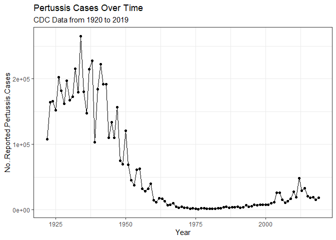
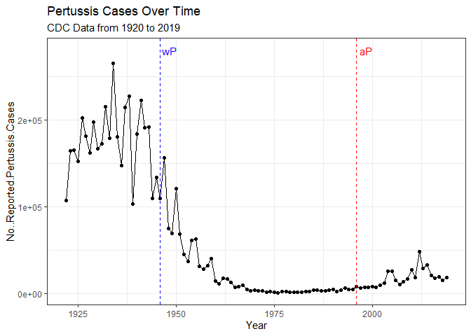
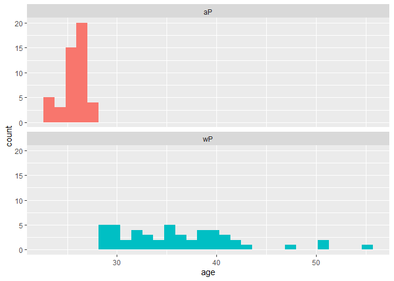
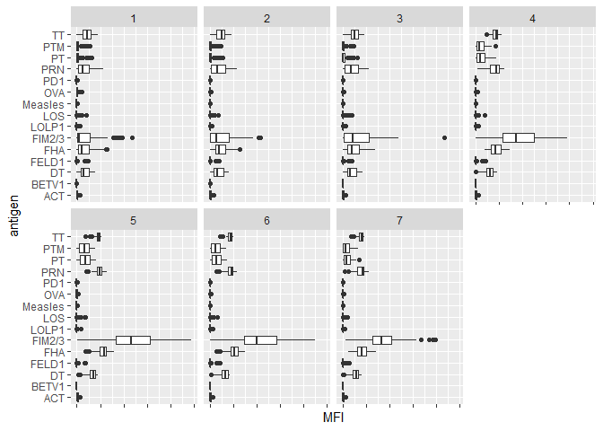
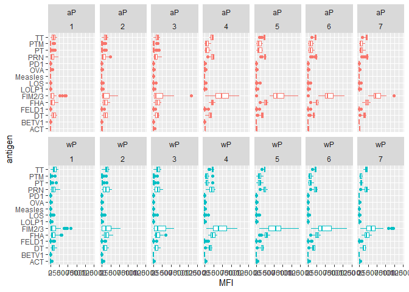
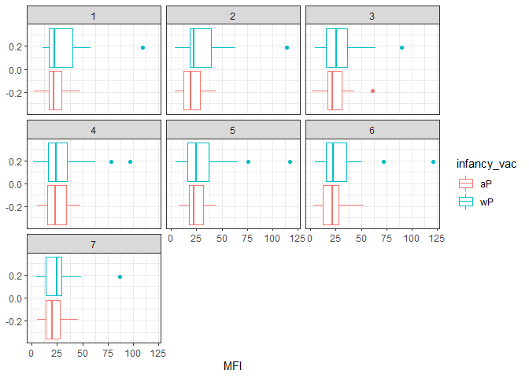
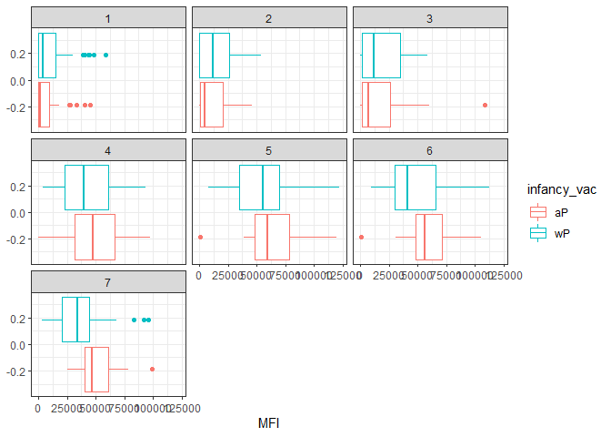
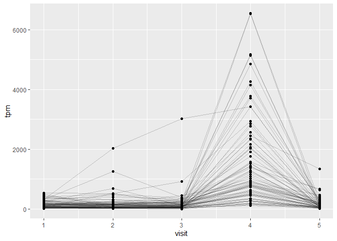

class19
================
Joshua Lau

``` r
#library(addin)
```

      Year No..Reported.Pertussis.Cases
    1 1922                       107473
    2 1923                       164191
    3 1924                       165418
    4 1925                       152003
    5 1926                       202210
    6 1927                       181411

### Q1

``` r
library(ggplot2)
```

    Warning: package 'ggplot2' was built under R version 4.0.5

``` r
p <- ggplot(cdc, aes(Year, No..Reported.Pertussis.Cases)) + 
  geom_point() + 
  geom_line() + 
  theme_bw() + 
  labs(title = "Pertussis Cases Over Time",
       subtitle = "CDC Data from 1920 to 2019")

p
```



### Q2

``` r
p + geom_vline(xintercept = 1946, color = "blue", linetype = 2) +
  geom_vline(xintercept = 1996, color = "red", linetype = 2) +
  annotate("text", x=1948.5, y=280000, label="wP", color = "blue") +
  annotate("text", x=1998.5, y=280000, label="aP", color = "red")
```



### Q3

We see that upon the change to aP vaccines there begins to be an
increase in pertussis cases. Some reasons for this may be that the aP
vaccine confers less immunity over time, or a less long lasting immunity
than the wP vaccine. Other reasons may include vaccine hestitancy,
greater volume of tests conducted and improvement in sensitivity, or
evolution of the pertussis bacteria to avoid vaccine driven immunity.

``` r
library(jsonlite)
```

    Warning: package 'jsonlite' was built under R version 4.0.5

``` r
subject <- read_json("https://www.cmi-pb.org/api/subject", simplifyVector = TRUE)

head(subject)
```

      subject_id infancy_vac biological_sex              ethnicity  race
    1          1          wP         Female Not Hispanic or Latino White
    2          2          wP         Female Not Hispanic or Latino White
    3          3          wP         Female                Unknown White
    4          4          wP           Male Not Hispanic or Latino Asian
    5          5          wP           Male Not Hispanic or Latino Asian
    6          6          wP         Female Not Hispanic or Latino White
      year_of_birth date_of_boost      dataset
    1    1986-01-01    2016-09-12 2020_dataset
    2    1968-01-01    2019-01-28 2020_dataset
    3    1983-01-01    2016-10-10 2020_dataset
    4    1988-01-01    2016-08-29 2020_dataset
    5    1991-01-01    2016-08-29 2020_dataset
    6    1988-01-01    2016-10-10 2020_dataset

### Q4

``` r
table(subject$infancy_vac)
```


    aP wP 
    47 49 

### Q5

``` r
table(subject$biological_sex)
```


    Female   Male 
        66     30 

### Q6

``` r
table(subject$race, subject$biological_sex)
```

                                               
                                                Female Male
      American Indian/Alaska Native                  0    1
      Asian                                         18    9
      Black or African American                      2    0
      More Than One Race                             8    2
      Native Hawaiian or Other Pacific Islander      1    1
      Unknown or Not Reported                       10    4
      White                                         27   13

``` r
library(lubridate)
```

    Warning: package 'lubridate' was built under R version 4.0.5


    Attaching package: 'lubridate'

    The following objects are masked from 'package:base':

        date, intersect, setdiff, union

``` r
subject$age <- time_length (today() - ymd(subject$year_of_birth), "years")
```

``` r
subject$age
```

     [1] 37.20192 55.20329 40.20260 35.20329 32.20260 35.20329 42.20123 38.20123
     [9] 27.20329 41.20192 37.20192 41.20192 26.20123 30.20123 34.20123 36.20260
    [17] 43.20329 26.20123 29.20192 36.20260 30.20123 28.20260 30.20123 33.20192
    [25] 47.20329 51.20329 51.20329 33.20192 25.20192 25.20192 32.20260 28.20260
    [33] 28.20260 25.20192 25.20192 35.20329 30.20123 36.20260 31.20329 30.20123
    [41] 25.20192 24.20260 26.20123 23.20329 25.20192 23.20329 23.20329 26.20123
    [49] 24.20260 25.20192 23.20329 27.20329 24.20260 25.20192 23.20329 42.20123
    [57] 40.20260 38.20123 32.20260 31.20329 35.20329 40.20260 26.20123 41.20192
    [65] 26.20123 35.20329 34.20123 26.20123 33.20192 40.20260 32.20260 26.20123
    [73] 25.20192 26.20123 38.20123 29.20192 38.20123 26.20123 25.20192 25.20192
    [81] 26.20123 25.20192 27.20329 25.20192 26.20123 26.20123 26.20123 25.20192
    [89] 25.20192 26.20123 26.20123 26.20123 27.20329 26.20123 26.20123 26.20123

### Q7

    -- Attaching packages --------------------------------------- tidyverse 1.3.2 --
    v tibble  3.1.6     v dplyr   1.0.8
    v tidyr   1.2.0     v stringr 1.4.0
    v readr   2.1.2     v forcats 1.0.0
    v purrr   0.3.4     

    Warning: package 'tibble' was built under R version 4.0.5

    Warning: package 'tidyr' was built under R version 4.0.5

    Warning: package 'readr' was built under R version 4.0.5

    Warning: package 'purrr' was built under R version 4.0.5

    Warning: package 'dplyr' was built under R version 4.0.5

    Warning: package 'stringr' was built under R version 4.0.5

    -- Conflicts ------------------------------------------ tidyverse_conflicts() --
    x lubridate::as.difftime() masks base::as.difftime()
    x lubridate::date()        masks base::date()
    x dplyr::filter()          masks stats::filter()
    x purrr::flatten()         masks jsonlite::flatten()
    x lubridate::intersect()   masks base::intersect()
    x dplyr::lag()             masks stats::lag()
    x lubridate::setdiff()     masks base::setdiff()
    x lubridate::union()       masks base::union()

``` r
ap <- subject %>% filter(infancy_vac == "aP")
wp <- subject %>% filter(infancy_vac == "wP")

mean(ap$age)
```

    [1] 25.52108

``` r
mean(wp$age)
```

    [1] 36.36553

**are they significantly different?**

``` r
t.test(ap$age, wp$age)
```


        Welch Two Sample t-test

    data:  ap$age and wp$age
    t = -12.092, df = 51.082, p-value < 2.2e-16
    alternative hypothesis: true difference in means is not equal to 0
    95 percent confidence interval:
     -12.644857  -9.044045
    sample estimates:
    mean of x mean of y 
     25.52108  36.36553 

**yes, p \< 0.05**

### Q8

``` r
subject$age_at_boost <- time_length(ymd(subject$date_of_boost) - ymd(subject$year_of_birth), "years")

head(subject$age_at_boost)
```

    [1] 30.69678 51.07461 33.77413 28.65982 25.65914 28.77481

``` r
ggplot(subject) +
  aes(age,
      fill=as.factor(infancy_vac)) +
  geom_histogram(show.legend=FALSE) +
  facet_wrap(vars(infancy_vac), nrow=2) 
```

    `stat_bin()` using `bins = 30`. Pick better value with `binwidth`.



**yes they appear to be significantly different, average age of wP is
higher and distributions do not overlap**

``` r
specimen <- read_json("https://www.cmi-pb.org/api/specimen", simplifyVector = TRUE) 
titer <- read_json("https://www.cmi-pb.org/api/ab_titer", simplifyVector = TRUE) 
```

### Q9

``` r
meta <- inner_join(specimen, subject)
```

    Joining, by = "subject_id"

``` r
dim(meta)
```

    [1] 729  15

### Q10

``` r
abdata <- inner_join(titer, meta)
```

    Joining, by = "specimen_id"

``` r
dim(abdata)
```

    [1] 32675    22

### Q11

``` r
table(abdata$isotype)
```


     IgE  IgG IgG1 IgG2 IgG3 IgG4 
    6698 1413 6141 6141 6141 6141 

### Q12

``` r
table(abdata$visit)
```


       1    2    3    4    5    6    7    8 
    5795 4640 4640 4640 4640 4320 3920   80 

**Visit 8 has much lower frequency than other visits**

``` r
ig1 <- abdata %>% filter(isotype == "IgG1", visit!=8)
head(ig1)
```

      specimen_id isotype is_antigen_specific antigen        MFI MFI_normalised
    1           1    IgG1                TRUE     ACT 274.355068      0.6928058
    2           1    IgG1                TRUE     LOS  10.974026      2.1645083
    3           1    IgG1                TRUE   FELD1   1.448796      0.8080941
    4           1    IgG1                TRUE   BETV1   0.100000      1.0000000
    5           1    IgG1                TRUE   LOLP1   0.100000      1.0000000
    6           1    IgG1                TRUE Measles  36.277417      1.6638332
       unit lower_limit_of_detection subject_id actual_day_relative_to_boost
    1 IU/ML                 3.848750          1                           -3
    2 IU/ML                 4.357917          1                           -3
    3 IU/ML                 2.699944          1                           -3
    4 IU/ML                 1.734784          1                           -3
    5 IU/ML                 2.550606          1                           -3
    6 IU/ML                 4.438966          1                           -3
      planned_day_relative_to_boost specimen_type visit infancy_vac biological_sex
    1                             0         Blood     1          wP         Female
    2                             0         Blood     1          wP         Female
    3                             0         Blood     1          wP         Female
    4                             0         Blood     1          wP         Female
    5                             0         Blood     1          wP         Female
    6                             0         Blood     1          wP         Female
                   ethnicity  race year_of_birth date_of_boost      dataset
    1 Not Hispanic or Latino White    1986-01-01    2016-09-12 2020_dataset
    2 Not Hispanic or Latino White    1986-01-01    2016-09-12 2020_dataset
    3 Not Hispanic or Latino White    1986-01-01    2016-09-12 2020_dataset
    4 Not Hispanic or Latino White    1986-01-01    2016-09-12 2020_dataset
    5 Not Hispanic or Latino White    1986-01-01    2016-09-12 2020_dataset
    6 Not Hispanic or Latino White    1986-01-01    2016-09-12 2020_dataset
           age age_at_boost
    1 37.20192     30.69678
    2 37.20192     30.69678
    3 37.20192     30.69678
    4 37.20192     30.69678
    5 37.20192     30.69678
    6 37.20192     30.69678

### Q13

``` r
ggplot(ig1) +
  aes(MFI, antigen) +
  geom_boxplot() + 
  facet_wrap(vars(visit), nrow=2) +
  theme(axis.text.x = element_blank())
```



### Q14

**the FIM2/3 antigen shows the greatest change in level of IG1 antibody
titers recognizing it over time. This is the mixture of Fim2 and Fim3
proteins, which are fimbrium proteins that form pillus in bacteria. The
change in MFI could be because that the FIM2/3 antigen is eliciting the
immune response **

``` r
ggplot(ig1) +
  aes(MFI, antigen, col=infancy_vac ) +
  geom_boxplot(show.legend = FALSE) + 
  facet_wrap(vars(infancy_vac, visit), nrow=2)
```



### Q15

``` r
filter(ig1, antigen=="Measles") %>%
  ggplot() +
  aes(MFI, col=infancy_vac) +
  geom_boxplot(show.legend = TRUE) +
  facet_wrap(vars(visit)) +
  theme_bw()
```



``` r
filter(ig1, antigen=="FIM2/3") %>%
  ggplot() +
  aes(MFI, col=infancy_vac) +
  geom_boxplot(show.legend = TRUE) +
  facet_wrap(vars(visit)) +
  theme_bw()
```



### Q16

**The time course data of IG1 recognition for measles antigen does not
change much through time. On the other hand, the time course data for
IG1 recognition of FIM2/3 shows an increase throughout time from visits
1 - 5 and a decrease from visits 6 onwards.**

### Q17

**The aP and wP data show similar trends (increase from visits 1-5 and
decrease 6 onwards) for the FIM2/3 antigen. A difference is that the aP
vaccination leads to higher IG1 maximum response on visit 5, and a
slower rate of decrease from visit 6 onwards.**

### Q18

``` r
url <- "https://www.cmi-pb.org/api/v2/rnaseq?versioned_ensembl_gene_id=eq.ENSG00000211896.7"

rna <- read_json(url, simplifyVector = TRUE)
ssrna <- inner_join(rna, meta)
```

    Joining, by = "specimen_id"

``` r
ggplot(ssrna) +
  aes(visit, tpm,group=subject_id) +
  geom_point() +
  geom_line(alpha=0.2)
```



### Q19

**expression of IG1 is highest at visit 4**

### Q20

**the expression trend roughly matches the time course data of the
antibody titer data, which shows an increase in IG1 activity from visit
1-5. However, the difference is that the maximum MFI in the antibody
data was typically day 5, where here we see that the expression is
maximum at visit 4**
